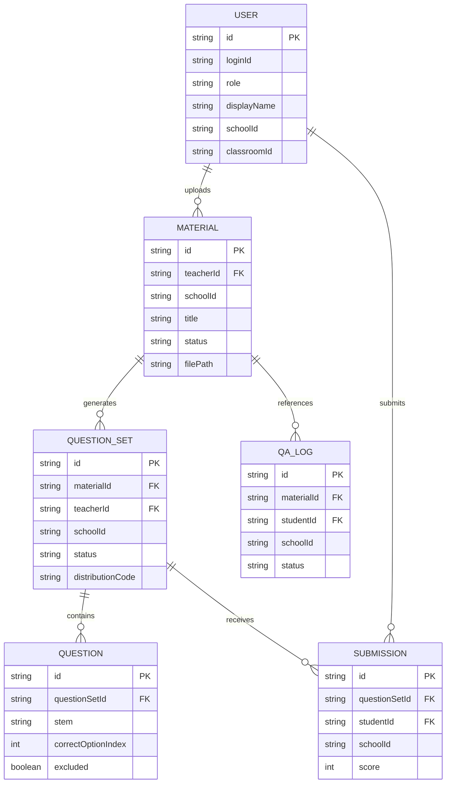

# ERD

```mermaid
erDiagram
    USER ||--o{ MATERIAL : uploads
    MATERIAL ||--o{ QUESTION_SET : generates
    QUESTION_SET ||--o{ QUESTION : contains
    USER ||--o{ SUBMISSION : submits
    QUESTION_SET ||--o{ SUBMISSION : receives
    MATERIAL ||--o{ QA_LOG : references

    USER {
        string id PK
        string loginId
        string role
        string displayName
        string schoolId
        string classroomId
    }

    MATERIAL {
        string id PK
        string teacherId FK
        string schoolId
        string title
        string status
        string filePath
    }

    QUESTION_SET {
        string id PK
        string materialId FK
        string teacherId FK
        string schoolId
        string status
        string distributionCode
    }

    QUESTION {
        string id PK
        string questionSetId FK
        string stem
        int correctOptionIndex
        boolean excluded
    }

    SUBMISSION {
        string id PK
        string questionSetId FK
        string studentId FK
        string schoolId
        int score
    }

    QA_LOG {
        string id PK
        string materialId FK
        string studentId FK
        string schoolId
        string status
    }
```
