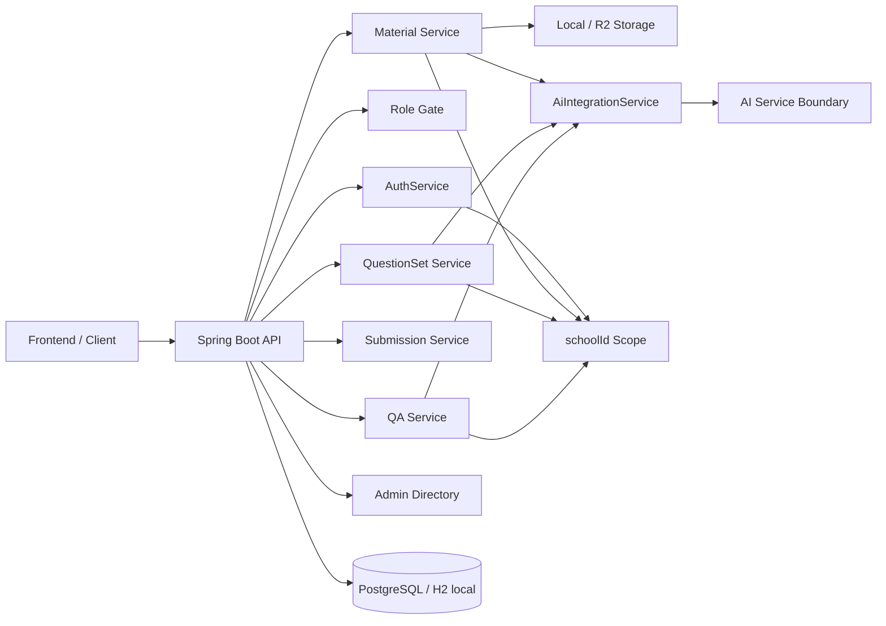
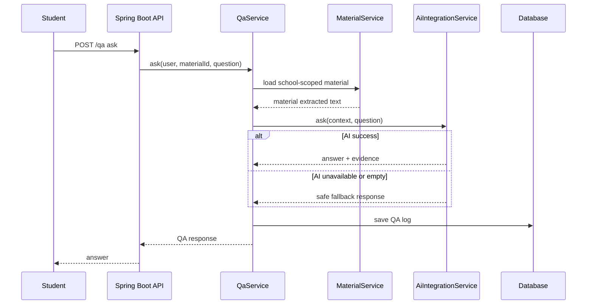
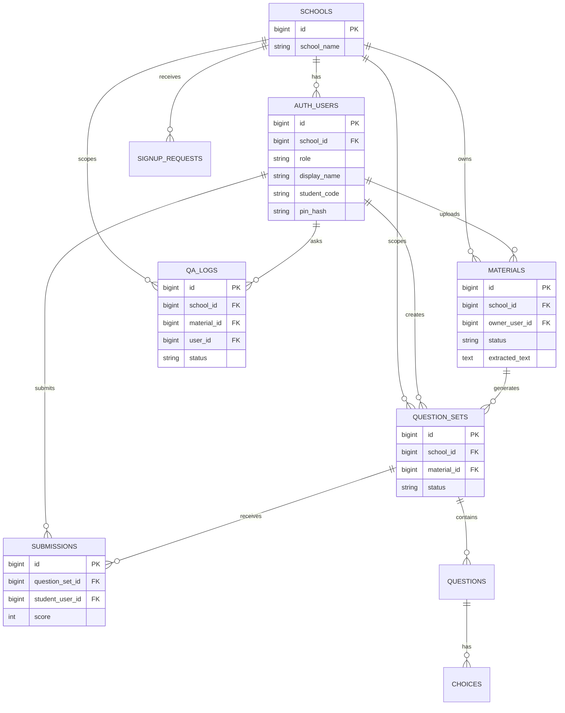

# AI-STUDY Backend

## 1. 한 줄 요약

Spring Boot가 인증·권한·학교 범위를 담당하고 별도 AI 서버와 연동해 자료 기반 문제 생성/QA를 수행하는 교육 지원 백엔드입니다.

## 2. 내가 맡은 역할

- Spring Boot API 서버 구현과 문서 정리
- `schoolId` 기반 학교/학급 데이터 scope 설계
- 교사/학생/운영자 역할 기반 접근 제어
- 자료 업로드, AI 추출, 문제 생성, 풀이/채점, QA 흐름 연결
- AI 서버 실패 시 fallback/error contract 정리
- 학생 PIN 로그인 방식의 한계와 보완점 문서화

## 3. 문제 정의

AI 교육 서비스는 AI API 호출만으로 완성되지 않습니다. 학교별 데이터가 섞이지 않아야 하고, 교사·학생·운영자의 권한이 분리되어야 하며, AI 서버가 실패해도 사용자가 이해 가능한 상태와 fallback 응답을 받아야 합니다.

## 4. 핵심 기능

- 자료 업로드와 자료 텍스트 추출
- AI 기반 문제 생성과 교사용 편집/게시
- 학생 풀이 제출과 결과 확인
- 자료 기반 QA와 QA 로그 저장
- `schoolId` 기반 논리적 멀티테넌시
- 교사/학생/운영자 역할 기반 API gate
- AI 장애 시 안전한 fallback 응답

## 5. 핵심 코드 바로가기

| 보여줄 코드 | 링크 | 이유 |
| --- | --- | --- |
| Spring Boot ↔ AI 서버 경계 | [`AiIntegrationService`](https://github.com/MINJI-AI-STUDY/AI-BACK/blob/main/src/main/java/com/aistudy/api/common/integration/AiIntegrationService.java) | `/extract-material`, `/generate-questions`, `/qa` 호출 경계를 한 곳에서 확인할 수 있습니다. |
| AI 서버 URL 설정 | [`application.properties`](https://github.com/MINJI-AI-STUDY/AI-BACK/blob/main/src/main/resources/application.properties) | `APP_AI_BASE_URL`로 AI 서버 경계를 환경별로 바꿉니다. |
| schoolId scope - 자료 | [`MaterialService`](https://github.com/MINJI-AI-STUDY/AI-BACK/blob/main/src/main/java/com/aistudy/api/material/service/MaterialService.java) | 학교별 자료 조회와 ready material 범위 검증을 담당합니다. |
| schoolId scope - 문제 | [`QuestionSetService`](https://github.com/MINJI-AI-STUDY/AI-BACK/blob/main/src/main/java/com/aistudy/api/question/service/QuestionSetService.java) | 교사가 수정 가능한 문제 세트와 학교 범위 문제 세트를 분리합니다. |
| schoolId scope - QA | [`QaService`](https://github.com/MINJI-AI-STUDY/AI-BACK/blob/main/src/main/java/com/aistudy/api/qa/service/QaService.java) | 학생/교사 QA 로그를 학교 범위 안에서 조회합니다. |
| RBAC enum | [`Role`](https://github.com/MINJI-AI-STUDY/AI-BACK/blob/main/src/main/java/com/aistudy/api/auth/Role.java) | `TEACHER`, `STUDENT`, `OPERATOR` 역할 기준입니다. |
| 역할 gate | [`AuthService.requireRole`](https://github.com/MINJI-AI-STUDY/AI-BACK/blob/main/src/main/java/com/aistudy/api/auth/AuthService.java) | controller 진입 전 역할 검증에 사용됩니다. |
| 교사용 문제 API | [`TeacherQuestionController`](https://github.com/MINJI-AI-STUDY/AI-BACK/blob/main/src/main/java/com/aistudy/api/question/controller/TeacherQuestionController.java) | 교사 권한으로 문제 생성/편집/게시 흐름을 확인할 수 있습니다. |
| 학생 자료 API | [`StudentMaterialController`](https://github.com/MINJI-AI-STUDY/AI-BACK/blob/main/src/main/java/com/aistudy/api/material/controller/StudentMaterialController.java) | 학생 권한으로 접근 가능한 자료 범위를 확인할 수 있습니다. |
| 운영자 관리 API | [`AdminDirectoryController`](https://github.com/MINJI-AI-STUDY/AI-BACK/blob/main/src/main/java/com/aistudy/api/admin/AdminDirectoryController.java) | 운영자 관점의 학교·사용자 관리 진입점입니다. |
| 자료 기반 QA | [`QaController`](https://github.com/MINJI-AI-STUDY/AI-BACK/blob/main/src/main/java/com/aistudy/api/qa/controller/QaController.java) | 학생 질문 요청의 controller 진입점입니다. |
| AI 실패 fallback 테스트 | [`AiIntegrationServiceTest`](https://github.com/MINJI-AI-STUDY/AI-BACK/blob/main/src/test/java/com/aistudy/api/common/integration/AiIntegrationServiceTest.java) | AI 연결 실패, 빈 응답, fallback contract를 테스트합니다. |
| PIN 로그인 한계 | [`StudentLoginRequest`](https://github.com/MINJI-AI-STUDY/AI-BACK/blob/main/src/main/java/com/aistudy/api/auth/StudentLoginRequest.java), [`AuthService.studentLogin`](https://github.com/MINJI-AI-STUDY/AI-BACK/blob/main/src/main/java/com/aistudy/api/auth/AuthService.java) | 학생 이름+PIN 로그인의 단순성과 중복 처리 한계를 설명합니다. |
| PIN 보완 | [`SignupService`](https://github.com/MINJI-AI-STUDY/AI-BACK/blob/main/src/main/java/com/aistudy/api/signup/service/SignupService.java), [`V10__add_student_code.sql`](https://github.com/MINJI-AI-STUDY/AI-BACK/blob/main/src/main/resources/db/migration/V10__add_student_code.sql) | PIN hash, 학생 code, 학교별 unique index로 보완한 흔적입니다. |

## 6. 아키텍처





## 7. ERD



## 8. API 명세

| Domain | 설명 |
| --- | --- |
| Auth | 교사/학생/운영자 로그인과 역할 확인 |
| Material | 자료 업로드, 추출, 재시도, 학교별 조회 |
| Question | 문제 생성, 편집, 게시 |
| Submission | 학생 풀이 제출, 결과 확인 |
| QA | 자료 기반 질문, AI 응답, QA 로그 |
| Admin | 학교/사용자 관리 |

## 9. 실행 방법

```bash
cp .env.example .env
set -a && source .env && set +a
./gradlew bootRun --args="--spring.profiles.active=local"
```

## 10. 테스트/검증

```bash
./gradlew test
./gradlew build
./gradlew assemble
```

대표 테스트:

- [`ApiApplicationTests.java`](src/test/java/com/aistudy/api/ApiApplicationTests.java)
- [`AiIntegrationServiceTest.java`](src/test/java/com/aistudy/api/common/integration/AiIntegrationServiceTest.java)
- [`SchoolMasterSyncServiceIntegrationTest.java`](src/test/java/com/aistudy/api/signup/service/SchoolMasterSyncServiceIntegrationTest.java)

## 11. 트러블슈팅

| 문제 | 원인 | 해결 | 배운 점 |
| --- | --- | --- | --- |
| AI 서버 실패 시 기능 전체 실패 가능 | AI 호출이 외부 서버 경계에 있음 | 빈 응답/fallback/error response contract를 서비스와 테스트로 고정 | AI 기능은 성공 경로보다 실패 경로 contract가 중요함 |
| 학교 데이터 혼선 위험 | 자료/문제/QA 조회가 단순 id 조회에 의존할 수 있음 | service에서 `schoolId` scoped 조회 메서드 사용 | 멀티테넌시는 DB row 접근 전 scope 확인이 필요함 |
| 학생 PIN 로그인 보안 한계 | 이름+PIN 방식은 추측/중복/공유 위험이 있음 | PIN hash, 중복 감지, studentCode unique index 추가 | MVP 인증 한계를 README에 명확히 남겨야 함 |

## 12. 한계와 개선점

- Swagger/OpenAPI 자동 문서는 아직 활성화되어 있지 않습니다. 현재는 controller/DTO와 README 표를 기준으로 확인합니다.
- 학생 PIN 로그인은 MVP 흐름입니다. 운영 수준에서는 시도 횟수 제한, 잠금, 승인 기반 재발급이 필요합니다.
- AI 응답 품질과 비용/지연 지표는 별도 AI 서버 로그와 함께 측정해야 합니다.
- 일부 테스트 결과 XML은 로컬 build 산출물이며 raw build 디렉터리는 저장소에 커밋하지 않습니다.
